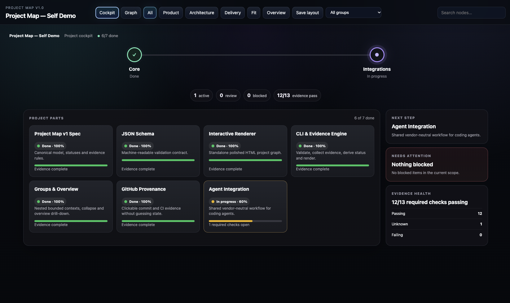
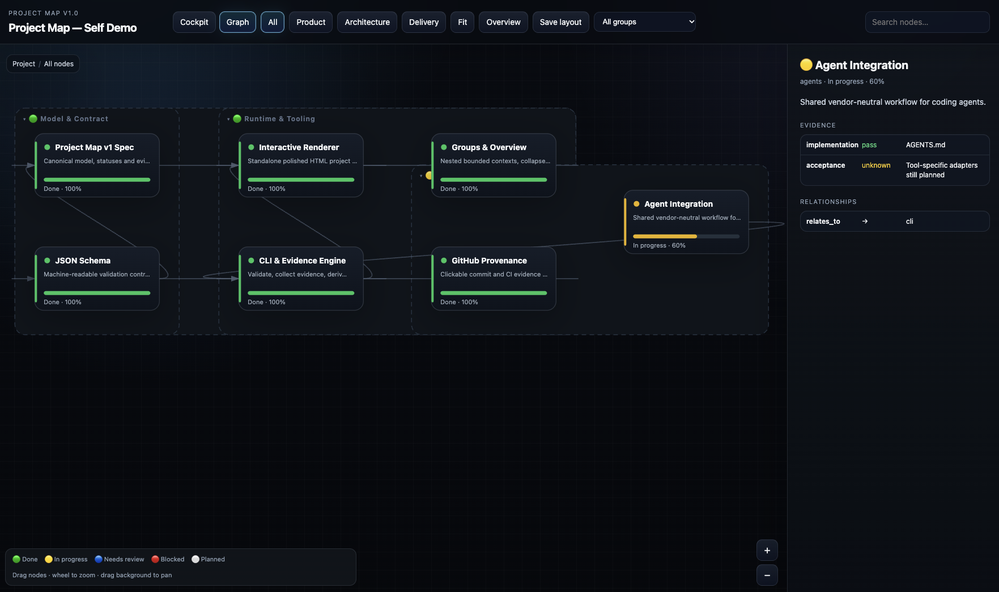

# Project Map

> **An evidence-based project cockpit and architecture graph for humans and coding agents.**

Project Map turns the state already present in your repository — code, tests, CI, documentation, acceptance evidence, architecture and delivery progress — into a visual project read model.

It does **not** replace your repository, issue tracker or CI system.

The repository stays the source of truth. Project Map makes that truth easier to inspect.

- **Evidence-first** — status should be supported by facts, not agent confidence.
- **Vendor-neutral** — works with Claude Code, Codex, Kiro, Copilot, humans, or any other workflow.
- **Repository-first** — the canonical model is a reviewable `project-map.json`.
- **Portable** — renders to one standalone HTML file.
- **Dependency-light** — the core runtime currently uses only the Python standard library.

---

## See it in action

### Project Cockpit

The default view answers the practical question:

> **Where is this project right now?**

It summarizes milestones, active work, review debt, blockers, next action and evidence health.



### Architecture & delivery graph

Switch to **Graph** when you need to understand structure, dependencies and the evidence behind a specific node.

The graph supports groups, nested bounded contexts, dependency edges, status highlighting, search, persistent layout and a detailed evidence inspector.



---

## Why Project Map?

Project boards usually show what someone says is happening.

Project Map is designed to show what the repository can actually support:

- what exists;
- what is planned;
- what is being implemented;
- what is blocked;
- what still needs review;
- which dependencies exist;
- what evidence supports completion;
- where that evidence came from.

The core rule is simple:

> **The agent proposes state. The validator proves state.**

Code existing somewhere in the repository is not enough to mark work as done.

---

# Quick start

## Requirements

Project Map is tested in CI with **Python 3.12**.

There are currently no external Python package dependencies.

```bash
python --version
```

If your system exposes Python as `python3`, use that command instead.

## Clone and render

```bash
git clone https://github.com/prestarius/project-map.git
cd project-map

python -m project_map validate
python -m project_map render
```

The generated UI is written to:

```text
.project-map/index.html
```

Open it:

### macOS

```bash
open .project-map/index.html
```

### Linux

```bash
xdg-open .project-map/index.html
```

### Windows

```powershell
start .project-map/index.html
```

---

## Run the curated self-demo

The repository includes a smaller demo based on **Project Map itself**.

```bash
python -m project_map \
  --map examples/project-map-self-demo.json \
  render \
  -o .project-map/self-demo.html
```

Then open:

```text
.project-map/self-demo.html
```

This is the fastest way to explore the Cockpit and Graph modes without modifying the dogfood map.

---

# Two complementary views

## Cockpit

Cockpit is the default landing view.

It derives a project-level summary from the same canonical nodes, groups and evidence used by the graph.

It includes:

- top-level milestone rail;
- completion, active, review and blocked counts;
- project-part cards;
- progress and status treatment;
- next actionable item;
- needs-attention panel;
- required evidence health;
- Product / Architecture / Delivery filtering.

Cockpit does **not** maintain separate project state.

It is a projection over `project-map.json`.

## Graph

Graph is the structural and diagnostic view.

It includes:

- dependency graph;
- draggable nodes;
- pan and zoom;
- curved directional edges;
- connection highlighting;
- Product / Architecture / Delivery filters;
- search;
- groups and swimlanes;
- nested groups;
- collapse / expand;
- persistent layout;
- high-level Overview mode;
- cross-group relationship aggregation;
- overview drill-down;
- node inspector;
- evidence and provenance links.

Use Cockpit to understand the project quickly.

Use Graph to investigate **why** the project is in that state.

---

# Status model

Project Map intentionally keeps the lifecycle small.

| Status | Meaning |
|---|---|
| ⚪ `planned` | Work has not started |
| 🟡 `in_progress` | Implementation is underway |
| 🔵 `needs_review` | Implementation exists, but required verification is incomplete or failed |
| 🔴 `blocked` | Progress is prevented by an explicit dependency or problem |
| 🟢 `done` | All required evidence passes |

A node should move toward `done` through evidence rather than interpretation.

---

# Evidence

A node can declare the facts required to support its state.

```json
{
  "id": "payments-api",
  "title": "Payments API",
  "status": "needs_review",
  "progress": 80,
  "evidence": {
    "implementation": {
      "required": true,
      "state": "pass",
      "detail": "src/payments/api.py"
    },
    "tests": {
      "required": true,
      "state": "pass",
      "detail": "unit and integration tests pass"
    },
    "ci": {
      "required": true,
      "state": "unknown",
      "detail": "Awaiting CI"
    }
  }
}
```

Evidence states:

- `pass`
- `fail`
- `unknown`
- `not_applicable`

If required evidence is unknown, Project Map should not silently promote the node to `done`.

---

# Deterministic evidence collectors

Project Map can maintain evidence manually or collect selected facts automatically.

| Collector | Purpose |
|---|---|
| `path_exists` | Verify that a declared path exists |
| `command` | Execute a command and use its exit code as evidence |
| `git_clean` | Verify that the working tree is clean |
| `github_actions` | Attach GitHub commit / CI provenance |

Example:

```json
{
  "tests": {
    "required": true,
    "state": "unknown",
    "collector": {
      "type": "command",
      "command": [
        "python",
        "-m",
        "unittest",
        "discover",
        "-s",
        "tests",
        "-v"
      ],
      "timeoutSeconds": 120
    }
  }
}
```

Collectors gather objective facts.

They do not inspect source code and guess semantic completion.

---

# CLI

Project Map exposes four core commands.

| Command | Purpose |
|---|---|
| `validate` | Validate the canonical Project Map |
| `render` | Generate the standalone HTML UI |
| `collect` | Run configured evidence collectors |
| `update` | Collect evidence and render in one step |

## Validate

```bash
python -m project_map validate
```

Use another map:

```bash
python -m project_map --map path/to/project-map.json validate
```

## Render

```bash
python -m project_map render
```

Custom output:

```bash
python -m project_map render -o build/project-map.html
```

## Collect

```bash
python -m project_map collect
```

Check whether committed evidence is stale without intentionally keeping the generated changes:

```bash
python -m project_map collect --check
```

Exit code `2` means collected evidence differs from the committed map.

> A `command` collector may execute project-defined commands. Coding agents should not run evidence collectors silently.

## Update

```bash
python -m project_map update
```

Custom map and repository root:

```bash
python -m project_map \
  --map docs/project-map.json \
  --root . \
  update
```

---

# Views

The same canonical graph can be explored from multiple perspectives.

### Product

**What are we building?**

Capabilities, user-facing scope and milestones.

### Architecture

**How is it built?**

Services, components, contracts, boundaries and dependencies.

### Delivery

**Where are we now?**

Implementation state, verification, blockers and evidence.

A node may belong to one or more views.

---

# Groups and bounded contexts

Large maps do not have to remain flat.

```json
{
  "groups": [
    {
      "id": "checkout",
      "name": "Checkout"
    },
    {
      "id": "platform",
      "name": "Platform"
    }
  ]
}
```

Assign a node to a group:

```json
{
  "id": "payments-api",
  "title": "Payments API",
  "groupId": "checkout"
}
```

Groups may be nested:

```json
{
  "id": "runtime",
  "name": "Runtime & Tooling",
  "parentGroupId": "core"
}
```

The renderer can visualize these as bounded contexts / swimlanes and supports filtering and collapse.

---

# Overview mode

Graph mode includes a high-level **Overview** projection.

At that level:

- root groups become summary cards;
- status is aggregated from descendant nodes;
- node counts are shown;
- node-level dependencies crossing group boundaries are aggregated;
- aggregated relationships can be inspected;
- selecting a group drills back into canonical detail.

Overview remains derived from the same nodes, groups and edges.

There is no separate architecture model.

---

# Persistent layout

Nodes may store stable graph coordinates.

```json
{
  "layout": {
    "x": 420,
    "y": 180,
    "pinned": true
  }
}
```

Without explicit coordinates, the renderer creates a deterministic dependency-oriented fallback layout.

To curate a layout:

1. drag nodes in Graph mode;
2. click **Save layout**;
3. save the generated `project-map.layout.json`;
4. copy the resulting `layout` values into `project-map.json`;
5. commit them to Git.

---

# GitHub provenance

Evidence may include clickable provenance.

```json
{
  "ci": {
    "required": true,
    "state": "pass",
    "detail": "GitHub Actions conclusion: success",
    "provenance": [
      {
        "kind": "commit",
        "label": "Commit abc1234",
        "url": "https://github.com/org/repo/commit/abc1234",
        "ref": "abc1234"
      },
      {
        "kind": "ci_run",
        "label": "Actions run 12345",
        "url": "https://github.com/org/repo/actions/runs/12345",
        "ref": "12345"
      }
    ]
  }
}
```

The GitHub adapter reads standard `GITHUB_*` context.

It does **not** claim that CI passed merely because it is executing inside GitHub Actions. The conclusion must be supplied explicitly.

---

# Agentic development workflow

Project Map is designed to live inside an agentic SDLC loop.

```text
brainstorm / plan
      ↓
Project Map
      ↓
implementation
      ↓
tests / CI / acceptance
      ↓
evidence collection
      ↓
status derivation
      ↓
Project Map
      ↓
review / merge
```

A practical workflow is:

**Before implementation**

1. inspect the current map;
2. identify affected nodes;
3. update planned or in-progress scope when needed.

**After implementation**

1. inspect changed files;
2. run or inspect tests;
3. inspect CI;
4. verify acceptance criteria;
5. update evidence;
6. derive status;
7. regenerate the UI;
8. review and merge.

---

# Coding agents

Project Map is intentionally independent of one coding-agent vendor.

The same repository contract can be consumed by:

- Claude Code;
- OpenAI Codex;
- AWS Kiro;
- GitHub Copilot;
- other coding agents;
- humans.

Agents should start with:

- [AGENTS.md](AGENTS.md)
- [project-map.json](project-map.json)
- [Project Map v1 specification](docs/spec-v1.md)

Tool-specific skills and adapters can be added later without changing the canonical model.

---

# Use Project Map in another repository

The current adoption path is intentionally explicit while packaging is still evolving.

1. add the `project_map/` runtime and `scripts/render.py`;
2. create `project-map.json`;
3. optionally add `project-map.schema.json` to your editor / validation workflow;
4. add `AGENTS.md` guidance for coding agents;
5. define deterministic evidence where useful;
6. validate and render locally or in CI.

A minimal canonical map looks like this:

```json
{
  "version": "1.0",
  "project": {
    "id": "my-project",
    "name": "My Project"
  },
  "views": [],
  "nodes": [],
  "edges": []
}
```

For the complete contract, see:

- [docs/spec-v1.md](docs/spec-v1.md)
- [project-map.schema.json](project-map.schema.json)

---

# Project structure

```text
.
├── AGENTS.md
├── README.md
├── project-map.json
├── project-map.schema.json
│
├── project_map/
│   ├── __init__.py
│   ├── __main__.py
│   ├── cli.py
│   ├── evidence.py
│   ├── github.py
│   └── validation.py
│
├── scripts/
│   └── render.py
│
├── docs/
│   ├── images/
│   │   ├── cockpit.png
│   │   └── graph.png
│   └── spec-v1.md
│
├── examples/
│   ├── project-map.json
│   └── project-map-self-demo.json
│
├── tests/
│   ├── test_cli.py
│   ├── test_evidence.py
│   ├── test_github.py
│   ├── test_render.py
│   ├── test_render_js.py
│   └── test_validation.py
│
└── .github/
    └── workflows/
        └── ci.yml
```

---

# CI

The repository dogfoods Project Map in GitHub Actions.

The workflow currently:

1. validates the dogfood map;
2. runs the Python test suite;
3. syntax-checks generated JavaScript through the renderer tests;
4. renders the generic example;
5. renders the curated self-demo;
6. renders the repository's own map;
7. smoke-tests GitHub provenance collection.

Run the core checks locally:

```bash
python -m project_map validate
python -m unittest discover -s tests -v
python -m project_map render
```

---

# Design principles

Project Map should remain:

- **evidence-based** — facts before inference;
- **vendor-neutral** — no dependency on one agent ecosystem;
- **repository-first** — no parallel planning database;
- **human-readable** — project state is reviewable in Git;
- **deterministic where possible** — collectors over guesses;
- **progressively adoptable** — small projects can remain small;
- **portable** — standalone HTML output;
- **low-dependency** — no framework required to view the result.

---

# Roadmap

Near-term areas worth exploring:

- easier packaging and installation;
- richer deterministic evidence collectors;
- GitLab CI provenance;
- PR and issue discovery;
- tool-specific coding-agent adapters;
- keyboard navigation;
- shareable URL state / deep links;
- minimap / graph orientation aid;
- release automation.

The roadmap follows the same principle as the product:

> Add capabilities only when they improve the project read model without creating another source of truth.

---

# Contributing

Before opening a change:

```bash
python -m project_map validate
python -m unittest discover -s tests -v
python -m project_map render
```

Changes should remain:

- evidence-based;
- vendor-neutral;
- dependency-light;
- backwards-compatible where practical;
- documented when behavior changes.

---

# License

A license will be added before the first tagged release.
